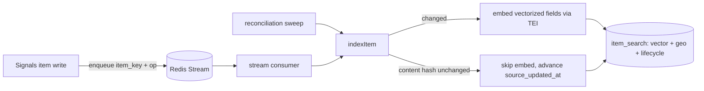
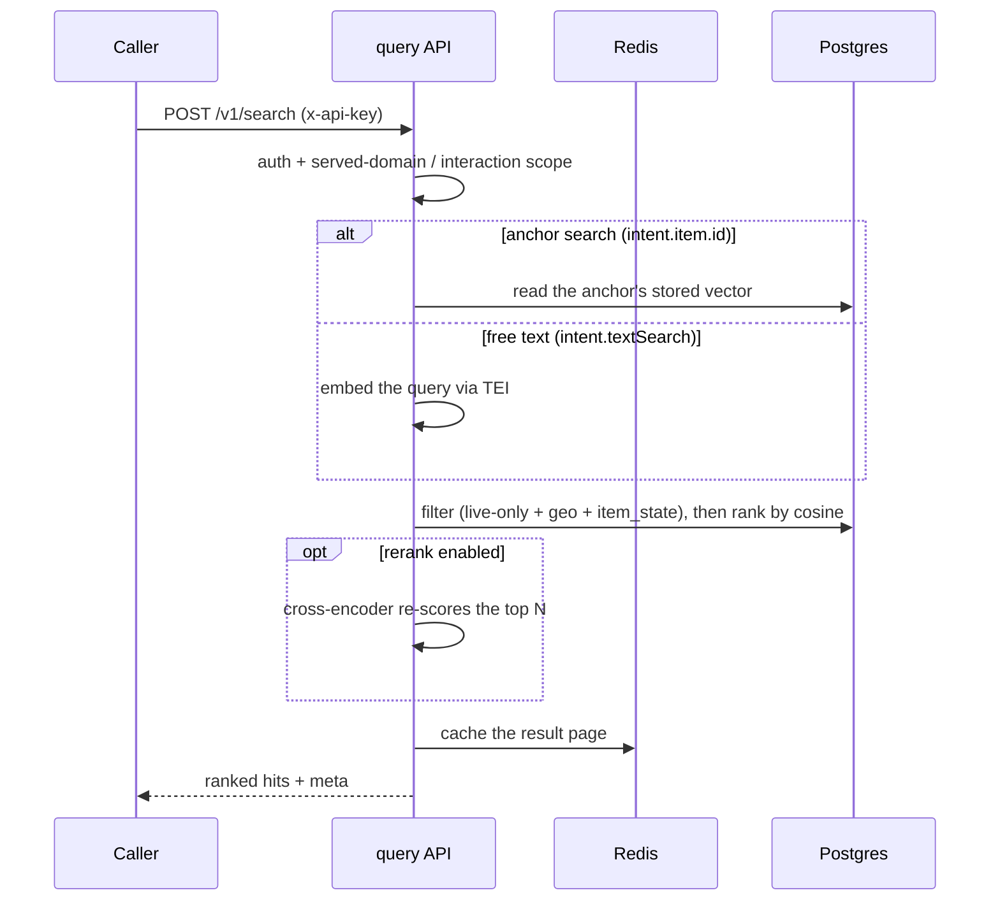

# signals-search

Search & discovery service for **Signals-DPG**. Provides authenticated, ranked-order **similarity search** (vector embeddings via [pgvector](https://github.com/pgvector/pgvector)), **geospatial filtering** (PostGIS), and structured filtering over Signals "items" (profiles).

This is **V1** — a deliberate stepping stone toward the future Beckn/NFH discovery service. It reads the existing **Signals-DPG database only** (single instance, no federation) and replaces the legacy Elasticsearch-based discovery design with Postgres-native search on the shared Postgres instance.

> Status (V1): the ingestion worker, the query API (`POST /v1/search`), and worker hardening for cutover are all implemented and tested. This repo also builds and publishes **both** container images used in deployment — the app image (serves the worker and the API from one image) and the TEI embedding image with `BAAI/bge-m3` baked in — via CI on `develop`. The Helm/deploy wiring lives in `bluedots-automation`, and the enqueue producer + authoritative `item_search` DDL live in `Signals-DPG`. V1 is in deploy/cutover.

## What it answers

- **"Find items relevant to me"** — similarity to an existing item's stored vector (no embedding call; fast path).
- **"Find relevant matches near me"** — similarity + geospatial radius. The radius can be centered on an explicit point, or — when the spatial clause omits `geometry` — on the **anchor item's own stored location** ("near this profile"). A spatial clause without `geometry` therefore requires `intent.item.id`, and the radius falls back to `SEARCH_DEFAULT_DISTANCE_METERS` when `distanceMeters` is omitted.
- **"Show me items relevant to X"** — free-text query embedded at request time.

All are ranked-order results, optionally combined with geo and structured filters, and scoped to allowed cross-domain interactions (seeker↔provider) defined in `network.json`.

### Structured filters

Filter clauses target `item_state.<field>` and support these operators: `eq`, `neq`, `in` (array), `gt`/`gte`/`lt`/`lte` (numeric), `contains` (jsonb `@>` — array field contains **all** given values), and `contains_any` (jsonb `?|` — array field shares **at least one** value with the given list). Field keys are always bound as parameters, never interpolated.

## How it works (one line)

The Signals item write path enqueues changes to Redis → an **ingestion worker** embeds configured public attributes and upserts an `item_search` row (vector + geography) → an **API service** (`POST /v1/search`) applies hard filters, ranks by vector similarity in Postgres, and caches results in Redis.

```
Signals write path ──enqueue──▶ Redis ──▶ ingestion worker ──embed──▶ item_search (pgvector + PostGIS)
Voice bot ──Bearer token──▶ POST /v1/search ──filter + ANN rank──▶ item_search ──join──▶ items (masked state)
```

## How it works (start to finish)

Two long-running processes share this repo and the same Signals Postgres database. They never talk to each other — their only coupling is the **`item_search` read-model table** (one row per indexed item: vector + geography + lifecycle). That is what makes the write side asynchronous and the read side fast.

### Write path — indexing



1. **Enqueue.** Signals' write path pushes `{item_key, op}` onto a Redis Stream. The producer lives in Signals-DPG, not here.
2. **Consume.** The worker reads batches with `XREADGROUP`, and recovers messages stranded by a dead consumer with `XAUTOCLAIM`.
3. **Serialize + embed.** Only fields marked `vectorize` in `network.json` are concatenated and sent to the embedding service. **Private fields are never embedded** — a `private: true` field configured for vectorization makes the registry *throw* at boot rather than skip silently.
4. **Upsert.** One row per `(item_network, item_domain, item_type, item_id)`, carrying the vector, a PostGIS geography, and `lifecycle_status`.
5. **Reconcile.** A periodic sweep re-indexes anything where `items.updated_at` is newer than the version already indexed, and prunes rows whose `items` row has been deleted. This is what catches direct DB writes and migrations that never went through the queue.

**Idempotency is the load-bearing property.** `indexItem` compares a content hash and skips re-embedding when nothing changed, so re-delivery, reclaim and sweep re-runs are all safe to repeat. An item with no vectorizable content is stored with a `NULL` vector rather than being rejected — it stays geo- and filter-searchable.

Internals — poison-message/DLQ handling, sweep isolation, and why the hash covers location and lifecycle — are in **[`src/ingest/README.md`](src/ingest/README.md)**.

### Read path — querying



1. **Authenticate.** `x-api-key`, validated against Signals' existing key store. A key must be enabled, unexpired, and not out of quota.
2. **Scope.** The caller's served domain, plus the **interaction matrix** from `network.json` for anchor searches — an anchor in another domain is only visible if `anchorDomain → contextDomain` is an allowed interaction, otherwise `403`. This is the real authorization boundary, not the API-key layer.
3. **Get a query vector.** Anchor search reads the item's *stored* vector (no embedding call — the fast path). Free-text embeds the query at request time, on every request: only result *pages* are cached, not query embeddings.
4. **Filter, then rank.** Hard filters run first — `lifecycle_status = 'live'`, PostGIS `ST_DWithin`, and structured `item_state` filters — and only the survivors are ranked by cosine distance. Filtering before ranking is why a narrow query stays cheap.
5. **Optionally rerank.** A cross-encoder can re-score the top results (off by default; see below).
6. **Cache + return.** The result page is cached in Redis for a short TTL. Each hit carries the **whole item row**, so a caller never needs a follow-up fetch.

### How relevance is computed

Every indexed item is turned into a **vector** — a list of numbers positioning it in a space where "similar meaning" means "geometrically close". Relevance is the **cosine** of the angle between two vectors: `1.0` = same direction (as similar as the model can tell), `0` = unrelated. Only the *angle* matters, not length, so a short profile and a long one are compared fairly.

Two models can be involved:

| stage | model | what it does | cost |
|---|---|---|---|
| **Rank** (always) | bi-encoder — BGE-M3 | Items and query are embedded *independently*; ranking is a vector-distance lookup Postgres can index (HNSW) | cheap, precomputed at write |
| **Rerank** (optional) | cross-encoder — `bge-reranker-v2-m3` | Reads query and item *together* and scores the pair directly. More accurate, but cannot be precomputed or indexed | one model call per candidate |

Hence the shape of the system: the bi-encoder narrows thousands of items to a shortlist, and the cross-encoder — when enabled — reorders only that shortlist. Reranking is **off by default** (`RERANK_DEFAULT`).

### Limits and defaults

All are env-configurable; these are the shipped defaults.

| behaviour | default | env |
|---|---|---|
| results per page | 20 (max **100**) | request `limit` / `offset` |
| candidates a reranker sees | 50 — precisely `max(limit, RESULT_TOPN)` | `RESULT_TOPN` |
| result cache TTL | 45s | `CACHE_TTL_SECONDS` |
| reranking | off | `RERANK_DEFAULT` |
| geo radius when `distanceMeters` is omitted | 30 km | `SEARCH_DEFAULT_DISTANCE_METERS` |
| embedding dimension | 1024, fixed at the column | `EMBEDDING_DIM` |

Two guarantees worth stating outright: **live-only** — non-`live` items are never returned; and **PII-safe** — private attributes are never embedded and results carry the masked `item_state`.

### Glossary

| term | meaning |
|---|---|
| **network** | A deployment's whole graph, e.g. `blue_dot`. Search never crosses networks, except `/v1/relevance`. |
| **domain** | A participant kind within a network — `seeker`, `provider`, `aggregator`. |
| **item** | One record: a profile, a job posting. Identified by `(network, domain, type, id)`. |
| **item_search** | The read-model table this service owns: vector + geography + lifecycle, one row per item. |
| **anchor** | An existing item used as the query — "find items relevant to *this* one". No embedding call. |
| **interaction matrix** | The `network.json` rules for which domain may see which. Enforced on anchor search. |
| **vectorize fields** | The `network.json` list of public attributes fed to the embedder. Private fields are rejected. |
| **bi-encoder / cross-encoder** | See the relevance table above. |
| **sweep** | The periodic reconciliation pass that catches anything the queue missed. |

**Where to read next:** [`docs/2026-06-09-signals-search-engine-architecture.md`](docs/2026-06-09-signals-search-engine-architecture.md) for component and latency detail, [`docs/2026-06-09-signals-search-engine-design.md`](docs/2026-06-09-signals-search-engine-design.md) for the decisions and their rationale, and `src/api/schemas.ts` (published at `/documentation`) as the contract's source of truth.

## Stack

- **TypeScript (ESM, NodeNext) + Fastify + Zod**
- **[postgres.js](https://github.com/porsager/postgres)** for DB access (parameterized `sql` templates — no ORM layer)
- **PostgreSQL** with `pgvector` (similarity) and `postgis` (geospatial), on the shared Signals-DPG database
- **Redis** (shared) — ingestion queue + result cache
- **Embedding & reranking via HuggingFace TEI** (in-cluster, OpenAI-compatible) — OSS default **BGE-M3** (Apache-2.0, 1024-dim) for embeddings + optional **bge-reranker-v2-m3** cross-encoder; hosted APIs (Gemini/OpenAI/Voyage) opt-in via config base_url. Output dimension ≤ 2000 for HNSW indexing

## Key design points

- **Vectorize at write, rank at read.** Vectors are precomputed asynchronously; only the query is embedded at request time. No pairwise scores are stored.
- **Similarity runs in Postgres** (pgvector HNSW + cosine) — no in-memory/FAISS layer.
- **PII-safe.** Only public (non-`private`) attributes are vectorized; `item_private_state` is never decrypted for embedding; results return masked state.
- **Full item in each result (#87).** A hit returns the whole item row — `item_id` + masked `item_state` plus `item_instance_url`, `item_schema_url`, `created_at`/`updated_at`, `created_by`, and `lifecycle_status` — so callers don't need a follow-up fetch to hydrate a result.
- **Live-only discovery.** Only `lifecycle_status = 'live'` items are returned.
- **Authenticated.** `/v1/search`, `/v1/search/flat`, and `/v1/relevance` require a credential. Where `KEYCLOAK_BASE_URL` is set (bearer auth is **off** unless it is — unset is the shipped default, so a day-one deployment is api-key-only), that credential can be `Authorization: Bearer <token>` — a Keycloak client-credentials token, validated against the realm JWKS (signature, `iss`, `exp`/`nbf`, an asymmetric `alg`, and a `typ` that is not an ID token's). The realm is shared with Signals and the aggregator, so two further gates apply: the token must name `signals-search` in its `aud`, and the client that Keycloak says minted it (`azp`) must be listed in `KEYCLOAK_SERVICE_CLIENT_IDS`. Neither is a formality — a token minted for Signals is otherwise perfectly valid here. A `403 CLIENT_NOT_PERMITTED` means the token was good but the client is not allowed to search; a `503 AUTH_PROVIDER_UNAVAILABLE` means Keycloak could not be reached, and is retryable. While `AUTH_ACCEPT_API_KEY=true` (the default), the legacy `x-api-key` (validated against Signals' key store) is still accepted, so callers can migrate independently. With Keycloak configured, a request carrying a bearer token is judged on that token — it never falls back to the api key; with Keycloak unconfigured a stray `Authorization` header is simply ignored, so proxies that forward one keep working.

## Flattened search — `POST /v1/search/flat` (for one-level-only tool integrations)

Some LLM-tool platforms (e.g. **Raya / Litwiz**, which drives the voice bot) can only produce a **flat object of string values** — they can't build the deeply nested `/v1/search` body (`message.intent.spatial[].geometry.coordinates`). `POST /v1/search/flat` accepts that flat shape and runs the **exact same search**; the canonical `/v1/search` contract is unchanged.

Rules for the flat body:

- Keys are the **dot-delimited canonical path** into the nested request.
- A **numeric key segment is an array index** (`...filters.0.op`, `...coordinates.1`).
- **Values may all be strings.** Each leaf is `JSON.parse`d to restore its real type (`"20"`→`20`, `"true"`→`true`, `["a","b"]`→array); if it isn't valid JSON it stays a string (`"plumber"`).
- **Type coercion is safe for equality filters.** A numeric-looking value parses to a **number** (`"560001"`→`560001`), but the `eq`/`neq`/`in` filter ops compare `item_state->>field` (text) against the value coerced with `String(...)`, so a numeric-string filter value (pincode, id-like code) still matches a string-stored field — no escaping needed. The one exception is the array op **`contains`** (jsonb `@>`, which is type-strict): to match string elements send them as a JSON-quoted string array, e.g. `"[\"560001\"]"`, not `"[560001]"`.
- **Required string fields must not be all-digits.** An all-numeric `context.messageId`/`networkId` parses to a number and fails validation; send a JSON-quoted string (`"\"12345\""`) if you must use one.
- **Use contiguous array indices from `0`.** A gap (e.g. `filters.0.*` and `filters.2.*` with no `filters.1.*`) leaves a hole in the rebuilt array and is rejected with `400 VALIDATION_ERROR`. Indices are capped (max 10,000) — a larger index is rejected with `400`, not silently expanded into a huge array.
- Keys containing `__proto__`, `constructor`, or `prototype` segments are ignored (they are never valid canonical paths).

Same auth as `/v1/search` — a bearer token (or `x-api-key` during the dual-accept window) — same responses, and the same `400 VALIDATION_ERROR` (raised after unflattening — including a malformed flat body, e.g. an over-large index or a key that is both a scalar and a parent). Worked examples, one per mode:

```jsonc
// free-text
{ "context.networkId": "blue_dot", "context.domain": "seeker", "context.itemType": "profile_1.0",
  "context.messageId": "abc-1", "message.intent.textSearch": "plumber" }

// anchor ("more like this profile")
{ "context.networkId": "blue_dot", "context.domain": "seeker", "context.itemType": "profile_1.0",
  "context.messageId": "abc-2", "message.intent.item.id": "0e0f...-uuid" }

// geo (explicit point + radius)
{ "context.networkId": "blue_dot", "context.domain": "seeker", "context.itemType": "profile_1.0",
  "context.messageId": "abc-3", "message.intent.textSearch": "plumber",
  "message.intent.spatial.0.op": "s_dwithin",
  "message.intent.spatial.0.geometry.type": "Point",
  "message.intent.spatial.0.geometry.coordinates.0": "77.59",
  "message.intent.spatial.0.geometry.coordinates.1": "12.97",
  "message.intent.spatial.0.distanceMeters": "5000" }

// structured filter
{ "context.networkId": "blue_dot", "context.domain": "seeker", "context.itemType": "profile_1.0",
  "context.messageId": "abc-4", "message.intent.textSearch": "plumber",
  "message.intent.filters.0.op": "eq",
  "message.intent.filters.0.target": "item_state.trade",
  "message.intent.filters.0.value": "plumber" }
```

The live request/response schema is also published in the generated OpenAPI at `/documentation` (spec JSON at `/documentation/json`).

## Pairwise relevance — `POST /v1/relevance`

Where `/v1/search` ranks a corpus against a query, `/v1/relevance` scores **two specific items against each other**. Given two item references it returns a single relevance **percentage (0–100)** — the cosine similarity of their already-stored embeddings, scaled ×100 (higher = more similar). It performs no embedding call and no writes; both items must already be indexed in `item_search`.

Same auth as search (a bearer token, or `x-api-key` during the dual-accept window). Score only — no band/confidence/reasoning. The body is directional — `source` is scored **from**, `target` is scored **against** — and `source → target` (network + domain) must be an **allowed interaction** (interaction matrix, same gate as anchor search, **cross-network pairs included**). Both items must be **live** and embedded with the **same model version**.

```jsonc
// request — networks may differ (cross-network relevance is supported)
{ "source": { "network": "purple_dot", "domain": "seeker",     "type": "profile_1.0", "id": "0e0f...-uuid" },
  "target": { "network": "blue_dot",   "domain": "aggregator", "type": "profile_1.0", "id": "1a2b...-uuid" } }

// response
{ "score": 87.34 }
```

Error responses:

- `400 VALIDATION_ERROR` — malformed body.
- `403 INTERACTION_NOT_ALLOWED` — `source → target` (network + domain) isn't an allowed interaction.
- `404 RELEVANCE_ITEMS_NOT_INDEXED` — either item is missing, not `live`, or has no embedding.
- `409 RELEVANCE_NOT_COMPARABLE` — the items were embedded with different model versions (e.g. mid model migration), so cosine is meaningless.

## Operations

Both processes expose HTTP liveness/readiness probes and shut down gracefully on `SIGTERM`/`SIGINT`.

- **API** (`API_PORT`, default 3100): `GET /health` (liveness) and `GET /ready` — readiness pings Postgres and Redis with a 2s timeout; returns `503 {status:"not_ready", checks:{postgres,redis}}` if either is unreachable. Graceful shutdown drains in-flight requests, then closes Redis + Postgres.
- **Worker** (`WORKER_HEALTH_PORT`, default 3101): `GET /health` (liveness) and `GET /ready` — readiness flips to `503` if the ingest loop hasn't made progress within `WORKER_HEARTBEAT_STALE_MS` (default 30s), so a wedged sweep/consumer is visible to k8s. Graceful shutdown lets the current `XREADGROUP` block finish (≤5s), then tears down the sweep timer, health server, and connections.

**Request correlation.** The API reads an inbound `x-request-id` (e.g. from Kong; length-capped at 200 chars) or generates `req-<uuid>` when absent, logs it as `reqId`, and echoes it on the response `x-request-id` header. `x-api-key`/`authorization` headers are redacted from logs.

**Embedding model version.** `EMBEDDING_SERVING_VERSION` (optional) appends a serving tag to `model_version` (`<model>@<dim>` + tag). It is **empty by default** — the value is byte-identical to the historic `<model>@<dim>`, so every stored content hash still matches and nothing re-embeds. Set it (e.g. `tei-1.9`) as part of a deliberate TEI serving-stack upgrade: because `model_version` feeds the ingest content hash, changing it makes the sweep **re-embed the whole corpus** on the next deploy, and it makes `POST /v1/relevance` return `409 RELEVANCE_NOT_COMPARABLE` across generations rather than silently scoring a mixed index.

## Scope

**In V1:** local single-instance search, ingestion worker, query API, embedding abstraction, Redis caching.
**Not in V1:** cross-instance/federated search, Beckn/NFH catalog subscription, learned re-rankers, fine-grained per-caller authorization.

## Design docs

In `docs/`:

- Design spec: `docs/2026-06-09-signals-search-engine-design.md`
- Tech architecture (diagrams): `docs/2026-06-09-signals-search-engine-architecture.md`
- Implementation plans: `docs/superpowers/plans/` (Plan 1 ingestion, Plan 2 query API, Plan 5 worker hardening; Plans 3 & 4 for Signals-DPG and automation live in those repos)

## Development

```bash
pnpm install
pnpm test        # vitest + testcontainers (Docker required; first run builds a pgvector+postgis image)
pnpm typecheck
pnpm build       # tsc -> dist/ (+ copies migration SQL)
pnpm worker      # ingestion worker (DATABASE_URL, REDIS_URL, EMBEDDING_BASE_URL, NETWORK_CONFIG_PATH); also binds a health port on WORKER_HEALTH_PORT
pnpm api         # query API on API_PORT (same env); serves POST /v1/search, /v1/search/flat, /v1/relevance and GET /health, /ready
```

Tests use Testcontainers; ensure Docker is running. The Postgres test image (`test/docker/Dockerfile.postgres`) bundles pgvector + PostGIS. See `.env.example` for all config. Note `RUN_MIGRATIONS` defaults to **off** — the worker assumes the `item_search` schema already exists (owned by Signals-DPG in prod) and fails fast if not; set `RUN_MIGRATIONS=true` for local/dev to apply the bundled migration.

## Container images

Two images are built and published to GHCR by CI:

- **App image** (`Dockerfile`, `.github/workflows/build-image.yml`) — a single multi-stage image that serves both the ingestion worker and the query API; the Helm deployments pick the entrypoint via `command` (default is the API on port 3100). Network configs are mounted at runtime (not baked in). Published as `ghcr.io/blue-dots-economy/signals-search:develop` (+ a `sha` tag) on push to `develop`.
- **TEI embedding image** (`docker/tei-bge-m3/Dockerfile`, `.github/workflows/build-tei-image.yml`) — HuggingFace TEI with `BAAI/bge-m3` (pinned revision) baked in, consumed by the `bluedots-automation` search-embeddings chart. Published as `ghcr.io/blue-dots-economy/tei-bge-m3:cpu-1.7-bge-m3` (+ a `sha` tag) on manual dispatch or when the Dockerfile/pinned revision changes.

## License

[MIT](./LICENSE) © Blue Dots Economy
