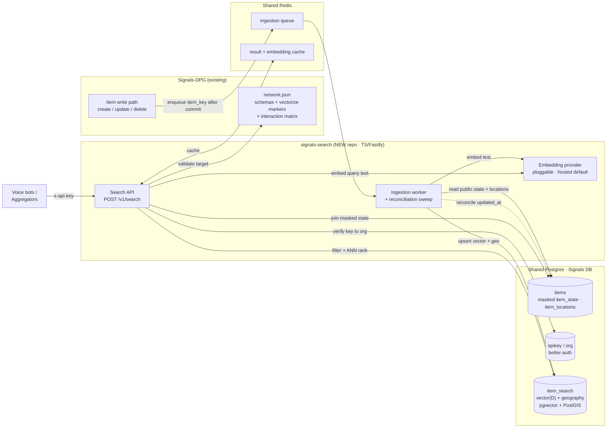
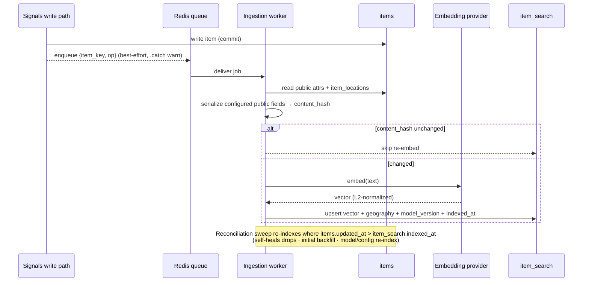
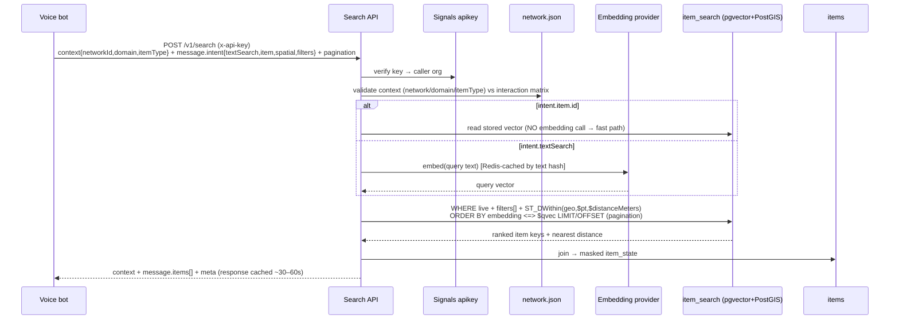

# Signals Search Engine — V1 Tech Architecture

**Companion to:** `2026-06-09-signals-search-engine-design.md`
**Date:** 2026-06-09

A quick visual + narrative overview. See the design spec for decision rationale, data model, and scale analysis.

---

## 1. One-line summary

A new **`signals-search`** service (TS/Fastify) keeps a **pgvector + PostGIS index** (`item_search`) in sync with the Signals `items` table — fed by a best-effort enqueue from the Signals write path — and serves an authenticated, ranked **`POST /v1/search`** combining vector similarity, geospatial, and structured filters, cached in Redis.

---

## 2. Component diagram

---

## 3. Ingestion flow (write side — vectorize at write, async)

---

## 4. Query flow (read side — embed query, filter-then-rank)

---

## 5. Latency at a glance

| Path | Embedding call? | Typical latency |
|---|---|---|
| `anchor.item_id` ("relevant to me") | No (stored vector) | < 30 ms (in-DB) |
| `anchor.text` ("relevant to X") | Yes (cached on repeat) | ~100–400 ms embed + < 30 ms search |
| `near` only ("matches near me") | No | < 30 ms (PostGIS) |

The external embedding hop is the only thing near the budget; ANN + geo are single-digit-to-low-tens of ms at ≤100k rows. Well within the < 1 s target.

---

## 6. What changes where

| Repo | Change |
|---|---|
| **signals-search** (new) | Ingestion worker, Search API, embedding-provider abstraction, `item_search` migration |
| **Signals-DPG** (existing) | Best-effort enqueue in item write/delete path; `vectorize` markers in `network.json`; enable `vector` + `postgis` extensions |
| **Shared Postgres** | New `item_search` table (partitioned by network/domain); pgvector + PostGIS enabled |
| **Shared Redis** | Ingestion queue + result/embedding cache |

---

## 7. Boundaries (single-purpose units)

- **Embedding provider** — `embed(texts) → vectors`; swap hosted/local by config. Knows nothing about Postgres or HTTP.
- **Ingestion worker** — owns "an item changed → its `item_search` row is correct". Idempotent via `content_hash`; self-healing via reconciliation.
- **Search API** — owns "a query → ranked, authorized, masked results". Stateless; all index work pushed into Postgres.
- **`item_search` table** — the index; the only shared contract between worker and API.
- Future **NFH catalog source** can replace the Signals enqueue behind the same `item_search` contract without touching the API.
