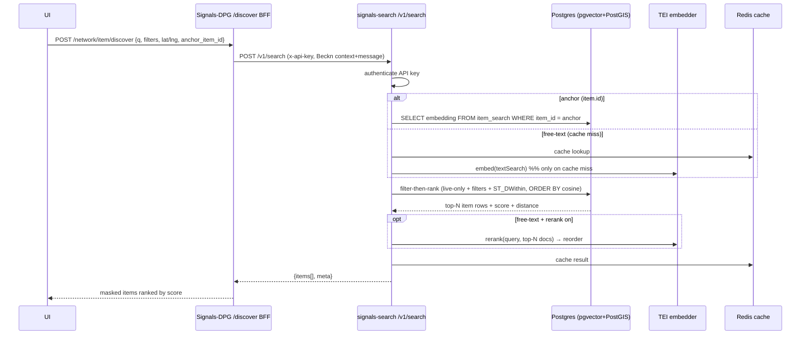

# How the Search Service Works

A practical, end-to-end guide to **signals-search** — how items get indexed, how a
search request is ranked, the API contract, and the design choices behind it.
Written for anyone (engineers, QA, PMs) who needs to understand the service without
reading the source.

> **One line:** items are turned into vectors when they're saved; a search takes a
> query (your profile, some text, and/or a location), **hard-filters** candidates,
> then **ranks them by meaning-similarity** (cosine) in Postgres, and returns the
> top page.

---

## 1. What it is

**signals-search** is the discovery/relevance engine for Signals-DPG. It answers three
questions over the network's items (seeker profiles, provider postings):

- **"Find items relevant to me"** — similarity to an existing item's vector (fast, no embedding call).
- **"Find relevant matches near me"** — similarity + geo radius.
- **"Show me items relevant to X"** — free-text query embedded at request time.

All results are **ranked**, optionally combined with geo + structured filters, scoped to
allowed seeker↔provider interactions, and **live-only + PII-masked**.

It reads the **same Postgres** as Signals-DPG (no separate store), using two extensions:
- **pgvector** — vector similarity (cosine).
- **PostGIS** — geospatial radius filtering.

---

## 2. The moving parts

| Component | Role |
|---|---|
| **Signals-DPG (SignalStack)** | System of record — writes `items`; hosts the `/network/item/discover` BFF the UI calls |
| **Ingestion worker** (`src/worker`, `src/ingest`) | Consumes item changes, embeds them, writes the `item_search` read-model |
| **Query API** (`src/api`, `POST /v1/search`) | Filters + ranks + returns results |
| **Postgres** | `items` (source) + `item_search` (vector + geography) |
| **Redis** | ingestion queue (stream) + result cache |
| **TEI embedder** | HuggingFace Text-Embeddings-Inference — text → vector (BGE-M3), + optional reranker |

The UI never calls signals-search directly. It calls the **Signals-DPG `discover` BFF**,
which holds the API key and proxies to `POST /v1/search`.

---

## 3. Two flows

### 3.1 Indexing (write path) — how an item becomes searchable

```mermaid
flowchart LR
  A[User creates/edits<br/>profile or posting] --> B[Signals-DPG writes<br/>items row]
  B --> C[[Enqueue change<br/>to Redis stream]]
  C --> D[Ingestion worker]
  D --> E[serialize: pick public<br/>vectorize:true fields → text]
  E --> F[TEI embedder<br/>text → 1024-dim vector]
  F --> G[(UPSERT item_search<br/>vector + geography + lifecycle)]
  H[Reconciliation sweep<br/>reads items directly] --> E
  B -.direct DB insert<br/>e.g. migration.-> H
```

- Only fields marked `"vectorize": true` in `network.json` are embedded
  (`src/config/vectorize_fields.ts`). A **private** field can never be vectorized — it throws.
- `vector_weight` boosts a field by **repeating its text** N times before embedding
  (`src/ingest/serialize.ts`), so higher-weight fields dominate the vector.
- The worker UPSERTs one `item_search` row per item: `embedding` (pgvector) + `geography` (PostGIS) + domain/type + lifecycle.
- **Two ingestion sources**, same indexer:
  1. **Stream** (`src/ingest/stream_consumer.ts`) — real-time, from the Redis enqueue on the Signals write path.
  2. **Reconciliation sweep** (`src/ingest/sweep.ts`) — reads `items` directly and re-indexes; this is how **direct DB inserts (e.g. data migration) become searchable** without touching the write path. A companion sweep removes `item_search` rows whose `items` row is gone (missed deletes).

### 3.2 Query (read path) — how a search is answered



**Steps inside `/v1/search`** (`src/api/search_route.ts`):
1. **Authenticate** the `x-api-key` against Signals' `apikey` table.
2. **Build the query vector:**
   - **Anchor mode** (`intent.item.id`) → reuse that item's stored vector — **no embedding call** (fast path).
   - **Free-text mode** (`intent.textSearch`) → embed the text via TEI — **only on a cache miss** (the most expensive hop).
3. **Filter-then-rank** in Postgres (`src/db/search_query.ts`):
   - **Hard filters:** `lifecycle_status = 'live'`, structured `filters`, geo `ST_DWithin`.
   - **Ranker:** cosine similarity — `score = (1 - (embedding <=> query))` (pgvector `<=>` = cosine distance).
   - **ORDER BY:** cosine when a vector is present; else geo distance; else recency.
4. **Optional rerank** (free-text only) — a cross-encoder re-scores the top-N pairs and reorders.
5. **Cache** the result in Redis (`search:<sha256(normalized request)>`).

---

## 4. The relevance model (why cosine)

Each item's public attributes are turned into a **vector** (a list of ~1024 numbers that
captures meaning). Two items are "similar" if their vectors point in the **same
direction** — measured by **cosine similarity**:

```
cos(θ) = (A · B) / (|A| × |B|)     # 1 = same direction, 0 = unrelated
```

Length is divided out, so a short profile and a long one match if their **meaning** lines
up. This is **semantic** search — meaning, not keyword. pgvector runs it with an **HNSW**
index (approximate nearest-neighbor) so it scales without scanning every row.

### Two models — a two-stage pipeline
| | Embedding model (BGE-M3) | Reranker (bge-reranker-v2-m3) |
|---|---|---|
| Type | Bi-encoder | Cross-encoder |
| Does | Vector per item/query independently | Scores a (query, doc) pair together |
| Speed | Fast (precomputed) | Slow (per candidate) |
| Role | Stage 1: rank all → top-N | Stage 2: re-order the top-N precisely |
| When | Always | Optional, free-text only (`RERANK_DEFAULT=false`) |

Stage 1 casts a wide, cheap net; stage 2 reads the shortlist carefully. Both are OSS BGE
models served via TEI.

---

## 5. API contract — `POST /v1/search`

The **only** functional endpoint (plus `GET /health`). Design decision **D5**: one
composable endpoint (filter-then-rank), not separate similarity/geo/relevance URLs.

**Auth:** `x-api-key: <service key>` (validated against Signals' `apikey` table).

### Request (Beckn-style `context` + `message`)
```json
{
  "context": {
    "version": "1.0.0",
    "messageId": "unique-id",
    "networkId": "blue_dot",
    "domain": "provider",
    "itemType": "job_posting_1.0"
  },
  "message": {
    "intent": {
      "textSearch": "fitter welding",
      "item": { "id": "uuid-of-my-profile" },
      "spatial": [{
        "op": "s_dwithin",
        "geometry": { "type": "Point", "coordinates": [75.12, 15.36] },
        "distanceMeters": 30000
      }],
      "filters": [
        { "op": "in", "target": "item_state.natureOfJob", "value": ["Full-time", "Apprenticeship"] }
      ]
    },
    "pagination": { "limit": 20, "offset": 0 }
  }
}
```

`intent` fields (all optional, combinable):
| Field | Meaning |
|---|---|
| `item.id` | **Anchor** — rank vs this item's stored vector ("relevant to me") |
| `textSearch` | **Free-text** — embedded at request time |
| `spatial[]` | **Geo hard-filter** — `ST_DWithin`; coordinates are **[lng, lat]** |
| `filters[]` | **Structured hard-filters** — `target` must be `item_state.<field>` |

Filter `op`: `eq, neq, in, contains, gt, gte, lt, lte`. Numeric ops require a finite
number; `in` requires an array.

### Response
```json
{
  "context": { "...": "echoed" },
  "message": {
    "items": [
      {
        "item_network": "blue_dot", "item_domain": "provider",
        "item_type": "job_posting_1.0", "item_id": "uuid",
        "item_state": { "...": "masked public fields" },
        "item_locations": [{ "lat": 15.4, "lng": 75.1, "label": "..." }],
        "score": 0.87,
        "distanceMeters": 4200
      }
    ],
    "meta": { "total": 137, "limit": 20, "offset": 0 }
  }
}
```
- `score` = cosine similarity (~0–1); `distanceMeters` present when geo was used.
- `item_state` is the **masked public** state — private fields never returned.

---

## 6. Limits, caching, and guarantees

| Concern | Behaviour |
|---|---|
| **Page size** | `limit` **max 100**, default **20**; page with `offset` |
| **Rerank pool** | `RESULT_TOPN` (default **50**) candidates re-scored on free-text |
| **Embedding dim** | ≤ 2000 (pgvector HNSW limit); BGE-M3 = 1024 |
| **Result cache** | Redis, key = `search:<sha256(normalized request)>`, TTL configurable |
| **Live-only** | Only `lifecycle_status = 'live'` items are returned |
| **PII-safe** | Only public fields vectorized; `item_private_state` never decrypted; results masked |
| **Auth** | Every `/v1/search` needs a valid API key |
| **Latency target** | `/v1/search` p95 < 1s |

### Map view vs list view (Signals-DPG side)
Different questions → different endpoints:
| | Map view | List view |
|---|---|---|
| Endpoint | `/network/item/markers` | `/network/item/discover` → this service |
| Ordered by | Location (viewport) | **Relevance** (cosine) + filters + text |
| Uses this service? | No (pure geo) | **Yes** |
| Limit | up to ~25,000 pins | 100/page (default 20) |

The map wants *many lightweight pins across an area*; the list wants *a short, ranked
page of the most relevant*. Only the **list** goes through signals-search.

---

## 7. Configuration (env)

| Var | Purpose |
|---|---|
| `DATABASE_URL` | Shared Signals Postgres (pgvector + PostGIS) |
| `EMBEDDING_BASE_URL` / `EMBEDDING_MODEL` / `EMBEDDING_DIM` | TEI embedder (default BGE-M3, 1024) |
| `RERANK_BASE_URL` / `RERANK_MODEL` / `RERANK_DEFAULT` | Optional cross-encoder reranker |
| `RESULT_TOPN` | Rerank candidate pool (default 50) |
| `EMBEDDING_TIMEOUT_MS` / `EMBEDDING_MAX_RETRIES` | Embedder resilience |
| Redis URL | Ingestion queue + result cache |

Embedding + rerank are behind a configurable `base_url`, so the OSS in-cluster TEI can be
swapped for a hosted API (Gemini/OpenAI/Voyage) without code changes.

---

## 8. Design decisions (the "why")

- **Vectorize at write, rank at read.** Item vectors are precomputed asynchronously; only
  the query is embedded live. No pairwise scores are stored.
- **Filter-then-rank in Postgres.** Structured + geo are hard filters; cosine is the ranker —
  one SQL pass, no in-memory/FAISS layer.
- **One composable endpoint.** Separate similarity/geo endpoints were rejected — they force
  client-side orchestration and a second round-trip for "relevant near me".
- **Postgres-native.** Replaces the legacy Elasticsearch design; reuses the Signals DB.
- **Reconciliation-driven ingestion.** The sweep reads `items` directly, so search works
  (and migrated/backfilled data becomes discoverable) without touching the write path.
- **PII-safe + live-only by construction.** Private fields can't be vectorized (throws);
  only live items are indexed/returned.

---

## 9. Glossary

- **Embedding / vector** — numeric representation of an item's meaning (~1024 numbers).
- **Cosine similarity** — angle-based similarity between two vectors (1 = same meaning).
- **Bi-encoder** — embeds item and query separately (fast, stage 1).
- **Cross-encoder / reranker** — scores a (query, doc) pair together (accurate, stage 2).
- **HNSW** — pgvector's approximate-nearest-neighbor index for fast vector search.
- **Anchor** — an existing item whose stored vector is the query ("relevant to me").
- **item_search** — the read-model table holding vectors + geography, kept in sync from `items`.

---

*Source of truth for the contract: `src/api/schemas.ts` (Zod). Deeper design rationale:
`docs/2026-06-09-signals-search-engine-design.md` and `…-architecture.md`.*
